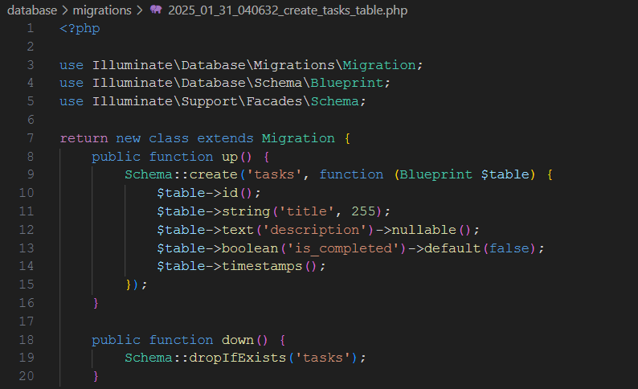
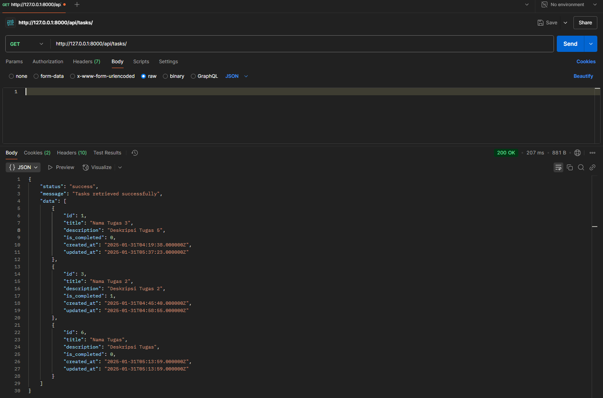
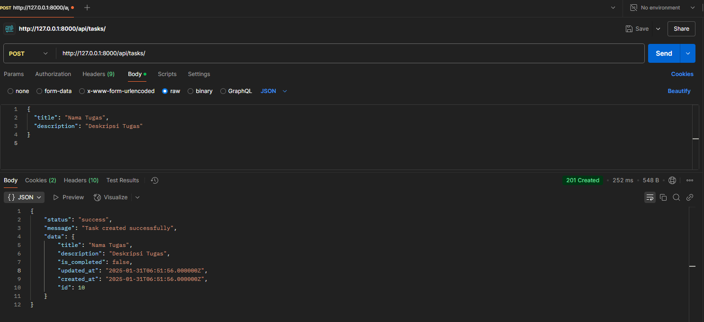
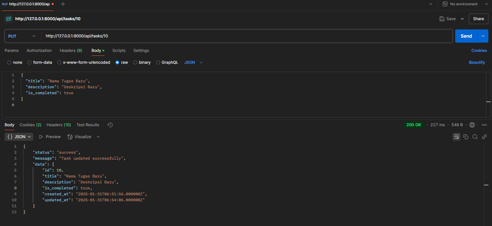
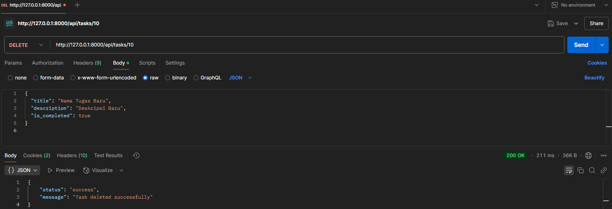
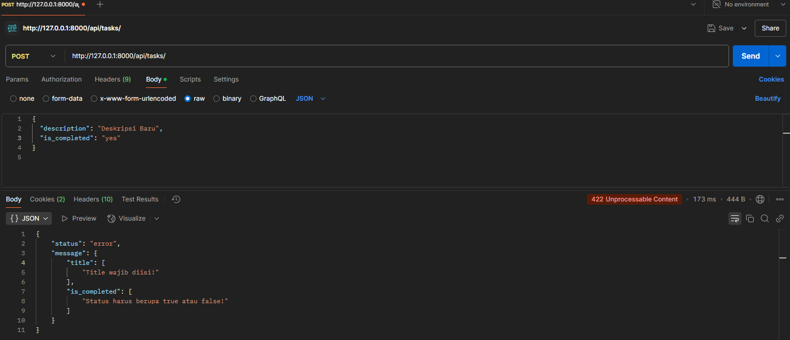
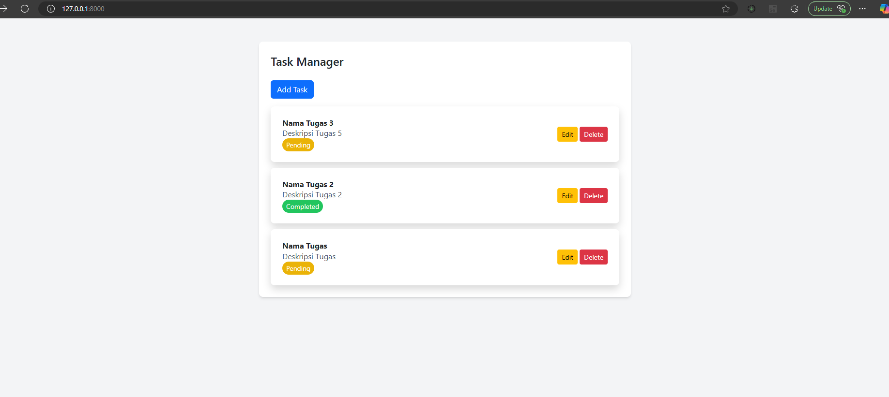

# Task Manager

Saya Pranata Dito Fitriyansyah, melampirkan hasil dari pengerjaan saya untuk Fullstack Developer Test dari PT. Bintang Mutli Teknologi


CV atau Resume    : https://shorturl.at/BEwnQ


Detail Portofolio : https://shorturl.at/ZbnPc


## Fullstack Developer Test

### 1. Jelaskan apa itu CORS!

CORS (Cross-Origin Resource Sharing) adalah mekanisme keamanan yang mengizinkan atau membatasi akses sumber daya dari domain berbeda. Dalam konteks web, CORS digunakan untuk mengontrol bagaimana suatu situs web dapat meminta data dari domain yang berbeda melalui permintaan HTTP.

### 2. Jelaskan tentang Asynchronous!

Asynchronous adalah metode pemrosesan yang memungkinkan suatu tugas berjalan tanpa harus menunggu tugas lain selesai. Dalam pengembangan web, teknik asinkron digunakan agar aplikasi tetap responsif, misalnya dengan AJAX untuk mengambil data dari server tanpa me-refresh halaman.

### 3. Apa saja yang bisa mengurangi load time website?

Beberapa cara untuk mengurangi load time website:

- **Optimasi Gambar**: Menggunakan format yang lebih efisien seperti WebP.
- **Gunakan AJAX**: Memuat data secara asinkron tanpa harus me-reload seluruh halaman, meningkatkan kecepatan dan pengalaman pengguna.
- **Minifikasi File**: Minify CSS, JavaScript, dan HTML.
- **Caching**: Menggunakan caching browser dan server.
- **Lazy Loading**: Menunda pemuatan gambar dan konten yang tidak langsung terlihat.
- **CDN (Content Delivery Network)**: Menggunakan jaringan distribusi untuk mempercepat akses ke sumber daya statis.

### 4. Task Manager Application

Aplikasi ini adalah sistem manajemen tugas sederhana yang memiliki fitur CRUD menggunakan Laravel sebagai backend dan AJAX untuk interaksi frontend.

#### Backend

##### 1. Model & Migrasi Database

Tabel `tasks` memiliki struktur sebagai berikut:

- `id` (integer, primary key, auto-increment)
- `title` (string, max 255, wajib diisi)
- `description` (text, opsional)
- `is_completed` (boolean, default false)
- `created_at` dan `updated_at` (timestamps)

##### 2. API Endpoints

| Method | Endpoint          | Deskripsi                       |
| ------ | ----------------- | ------------------------------- |
| GET    | `/api/tasks`      | Mengambil semua daftar tugas    |
| POST   | `/api/tasks`      | Menambahkan tugas baru          |
| PUT    | `/api/tasks/{id}` | Mengupdate tugas berdasarkan ID |
| DELETE | `/api/tasks/{id}` | Menghapus tugas berdasarkan ID  |

##### 3. Validasi Backend

- `title` wajib diisi dengan maksimal 255 karakter.
- `description` opsional.
- `is_completed` harus berupa boolean.

##### 4. Response JSON Format

```json
{
  "status": "success",
  "message": "Deskripsi pesan",
  "data": {...}
}
```

#### Frontend

##### 1. Tampilan Utama

- Tabel daftar tugas.
- Tombol "Add Task" untuk menambah tugas baru.
- Tombol "Edit" dan "Delete" untuk mengubah atau menghapus tugas.

##### 2. Fitur CRUD

- **Create**: Form untuk menambah tugas baru.
- **Read**: Mengambil daftar tugas dari API.
- **Update**: Edit tugas melalui modal/form yang telah terisi sebelumnya.
- **Delete**: Hapus tugas dengan konfirmasi sebelum menghapus.

##### 3. Interaksi Asinkron

Menggunakan AJAX untuk semua operasi CRUD tanpa reload halaman. Setelah operasi berhasil, daftar tugas diperbarui secara otomatis.

##### 4. Desain Sederhana

Menggunakan **Bootstrap** untuk styling.

### Bukti Pengerjaan

Setiap fitur yang telah dikerjakan disertai dengan screenshot hasil implementasi:

1. **Model & Migrasi Database**  
   

2. **API Endpoints**
   - GET `/api/tasks`  
     
   - POST `/api/tasks`  
     
   - PUT `/api/tasks/{id}`  
     
   - DELETE `/api/tasks/{id}`  
     

3. **Validasi Backend**  
   

4. **Tampilan Frontend**  
   


---

### Cara Menjalankan Proyek

1. Clone repositori:

2. Install dependencies:
   ```sh
   composer install
   npm install
   ```
3. Konfigurasi **.env** dan jalankan migrasi:
   ```sh
   cp .env.example .env
   php artisan migrate
   ```
4. Jalankan server backend:
   ```sh
   php artisan serve
   ```
5. Akses di browser menggunakan localhost

---

### Teknologi yang Digunakan

- **Backend**: Laravel
- **Frontend**: JavaScript (AJAX, Bootstrap)
- **Database**: MySQL, PHPmyadmin

---

### Lisensi

MIT License

